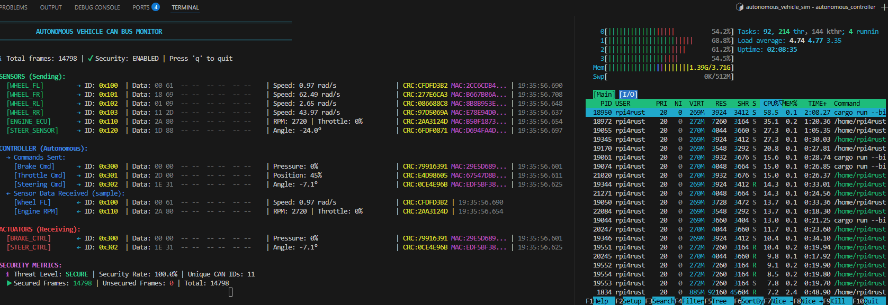

# rust-v-hsm-can

Virtual Hardware Security Module (V-HSM) for CAN Bus security, written in Rust.

**RUNNING ON REAL HARDWARE: Raspberry Pi 4 with Multi-Core Architecture**

This project is deployed on **Raspberry Pi 4 Model B** (4x ARM Cortex-A72 cores) with CPU affinity pinning, demonstrating real-time automotive CAN bus security on embedded hardware.

**CAN Bus Monitor on Raspberry Pi 4:**



This repository contains two CAN bus implementations:

1. **[basic/](basic/)** - Original simple CAN bus implementation for learning and testing
2. **[autonomous_controller/](autonomous_controller/)** - **MAIN PROJECT**: Autonomous vehicle CAN bus running on Raspberry Pi 4 hardware with 9 ECUs

## Quick Start (on Raspberry Pi 4)

### Option A: Autonomous Vehicle System (with HSM security)
```bash
cd autonomous_controller
cargo run              # Standard mode
cargo run -- --perf    # With HSM performance metrics
# Press 'q' to quit
```

The system will automatically:
1. Start HSM service on dedicated Core 3 (crypto engine)
2. Launch bus server on Core 0
3. Start 6 sensor ECUs on Core 1 (wheels, engine, steering)
4. Start 3 controller ECUs on Core 2 (autonomous, brake, steering)
5. Display real-time dashboard on Core 0

### Option B: Basic CAN Simulator
```bash
cd basic
cargo run --bin demo  # Single-process demo
# OR multi-terminal mode (see basic/README.md)
```

## Architecture Overview

### Basic Project Architecture

```
Input ECU ──┐
            │
            ├──> Virtual CAN Bus ──┬──> Output ECU
            │                      │
            │                      └──> Monitor
            │
More ECUs ──┘
```

The system simulates a complete CAN bus network:

- **Virtual CAN Bus**: Broadcast communication channel that simulates real CAN bus behavior. All connected nodes see all messages with sub-millisecond latency.
- **Input ECU (ARM Cortex-M4)**: Emulates a sensor/actuator ECU that sends CAN frames to the bus. Supports both standard (11-bit) and extended (29-bit) CAN IDs.
- **Output ECU (ARM Cortex-M7)**: Emulates a high-performance control ECU that receives and processes CAN frames from the bus.
- **Monitor**: Observes all bus traffic with color-coded timestamps, IDs, data length, and payload.

All components connect to a shared broadcast bus. Any frame sent by any ECU is received by all other connected components.

### Autonomous Vehicle Project Architecture (Running on Pi4 Hardware)


**Hardware Platform**: Raspberry Pi 4 Model B
- **CPU**: 4x ARM Cortex-A72 cores @ 1.5GHz (64-bit ARMv8-A)
- **Architecture**: aarch64 (ARM64)
- **Memory**: 4GB LPDDR4
- **OS**: Linux 6.12.34+rpt-rpi-v8

**Multi-Core Architecture**:
```
Core 0: Bus Server + Monitor          (Infrastructure)
Core 1: 6 Sensor ECUs                 (Data producers)
Core 2: 3 Controller/Actuator ECUs    (Data consumers)
Core 3: HSM Service                   (Dedicated crypto engine)
```

**9 ECUs**: wheel_fl, wheel_fr, wheel_rl, wheel_rr, engine_ecu, steering_sensor, autonomous_controller, brake_controller, steering_controller

**Key Components**:
- 6 Sensor ECUs sending real-time vehicle data
- **Centralized HSM Service** on dedicated Core 3 (Unix socket IPC)
- Hardware-based RNG (Linux getrandom syscall)
- AES-256-GCM encryption with hardware acceleration
- V-HSM Security Layer protecting all communications with HMAC-SHA256 + CRC32
- CAN Bus Server as central TCP broadcast hub
- Autonomous Controller processing sensor data and making driving decisions
- 2 Actuator ECUs receiving control commands
- Monitor providing real-time dashboard and security status

**Features**:
- Virtual HSM (Hardware Security Module) with HMAC-SHA256 MAC and CRC32 verification
- **Multi-core processing** with CPU affinity pinning (process-per-ECU model)
- **Hardware-based random number generation** (cryptographically secure)
- Secure boot and protected memory for all ECUs
- Automotive CAN message IDs (0x100-0x3FF range)
- Periodic sensor broadcasts at 10-20 Hz
- Autonomous control loop with speed control and path following
- Safety features: brake pressure limiting, steering rate limiting
- Anomaly detection for wheel speed discrepancies
- Real-time dashboard monitor with security status

### Emergency Attack Response

When an unsecured CAN frame (MAC=0) is detected, the autonomous controller immediately enters emergency shutdown mode:
- **Automatic Shutdown**: All control commands (brake, throttle, steering) stop immediately
- **Safe Monitoring**: Continues reading sensor data but takes NO action
- **Visible Alert**: Monitor displays red warning banner: "⚠ AUTONOMOUS CONTROLLER DEACTIVATED ⚠"
- **Manual Recovery**: Requires restart to resume operation

This fail-safe mechanism prevents compromised commands from reaching vehicle actuators during an active attack.


### HSM Security Keys

Each ECU's Virtual HSM manages 7 cryptographic keys (all 256-bit):

- **Master Key**: Root key for key derivation hierarchy
- **Secure Boot Key**: Firmware signature verification
- **Firmware Update Key**: Firmware update authorization
- **Symmetric Comm Key**: HMAC-SHA256 MAC generation for CAN messages
- **Key Encryption Key**: Secure key exchange/provisioning
- **RNG Seed Key**: Deterministic random number generation
- **Seed/Key Access Token**: Diagnostic access control (UDS seed/key)

Each ECU also maintains **MAC Verification Keys** for all trusted ECUs on the network.

### Attack Detection

All ECUs use threshold-based attack detection with structured error types:
- **MAC errors**: Tolerates 3 consecutive failures (strict cryptographic security)
- **CRC errors**: Tolerates 5 consecutive failures (noise/corruption tolerance)
- **Unsecured frames**: Triggers immediately (no tolerance for injection attacks)

Error counters reset automatically on successful frame validation, allowing recovery from transient failures while detecting sustained attacks.

### ISO 21434 Cybersecurity Compliance

This project implements comprehensive ISO/SAE 21434:2021 (Road Vehicles - Cybersecurity Engineering) compliance features:

**Automated Incident Response** (§8.6, §9.4.3):
- Severity-based incident classification (Low/Medium/High/Critical)
- 8 incident categories with automated response actions
- Graduated response: Log → Alert → Fail-Safe → Isolate ECU
- Incident escalation and resolution tracking

**Security Event Correlation** (§9.4.2, §10.4):
- Pattern-based attack detection across time and ECUs
- 8 attack patterns: Coordinated Multi-Source, Progressive Escalation, Targeted Attack, Multi-ECU Replay, Brute Force, etc.
- Time-window correlation analysis (60-second windows)
- Automated mitigation recommendations

**Firmware Update Rollback** (§8.5, §10.3):
- Secure firmware updates with signature verification
- Automatic rollback on validation failure
- Boot attempt limiting (max 3 attempts)
- Version rollback prevention
- Update lifecycle: Pending → Installing → AwaitingValidation → Committed

**TARA Documentation** (§8.4):
- Threat Analysis and Risk Assessment generator
- STRIDE threat modeling methodology
- ISO 21434 risk matrix (impact × feasibility)
- 6 pre-defined automotive threat scenarios
- Automated TARA report generation

**Security Audit Reports**:
- Comprehensive ISO 21434 compliance documentation
- Coverage of 10+ ISO 21434 requirements
- Run: `cargo run --bin iso21434_audit_report`
- Run: `cargo run --bin generate_tara_report`

See [autonomous_controller/README.md](autonomous_controller/README.md) for complete documentation.

### Advanced Automotive Security Features (Phase 3 & 4)

**UDS Secure Diagnostics** (ISO 14229):
- Seed/key challenge-response authentication
- 4 security levels (Level1-Level4) with graduated permissions
- Session management with timeout protection
- Lockout mechanism after 3 failed attempts (60-second lockout)
- Diagnostic services: Security Access, Session Control, ECU Reset

**Signed Configuration Management**:
- Cryptographic integrity protection for ECU configurations
- HMAC-SHA256 signatures with SHA256 fingerprinting
- 5 configuration types: Access Control Policy, Diagnostic Config, Network Config, Security Config, Firmware Metadata
- Authorized signer validation (FACTORY, FLEET_MANAGER)
- Tamper detection and rejection

**Enhanced Security Dashboard**:
- Real-time threat level visualization (Secure/Low/Medium/High/Critical)
- Security rate percentage tracking (secured vs unsecured frames)
- Per-ECU attack statistics with attack rate calculation
- Unique CAN ID monitoring
- Attack duration tracking
- Color-coded threat indicators

**Security Gateway** (Zone Segmentation):
- Zone-based CAN bus isolation: Powertrain, Chassis, ADAS, Infotainment, Body, Diagnostics
- Zone-to-zone routing policies with default actions (Allow/Deny/Audit)
- CAN ID whitelisting per route
- Audit logging for cross-zone traffic
- Prevents infotainment compromise from affecting safety-critical systems
- Statistics tracking: messages forwarded/blocked/audited

## Build

Each project is independent:

```bash
# Build autonomous vehicle simulator
cd autonomous_controller
cargo build --release

# Build basic simulator
cd ../basic
cargo build --release
```

## Project Structure

```
rust-v-hsm-can/
├── basic/                      # Original simple implementation
│   ├── src/
│   │   ├── types.rs           # CAN frame types
│   │   ├── can_bus.rs         # Virtual CAN bus
│   │   ├── ecu.rs             # ECU emulator
│   │   ├── network.rs         # TCP networking
│   │   └── bin/
│   │       ├── bus_server.rs  # Bus server
│   │       ├── monitor.rs     # Traffic monitor
│   │       ├── input_ecu.rs   # Interactive sender
│   │       ├── output_ecu.rs  # Receiver
│   │       └── demo.rs        # Single-process demo
│   └── README.md
│
├── autonomous_controller/      # Realistic autonomous vehicle
│   ├── src/
│   │   ├── types.rs           # Automotive CAN types
│   │   ├── can_bus.rs         # Virtual CAN bus
│   │   ├── ecu.rs             # ECU emulator
│   │   ├── network.rs         # TCP networking
│   │   ├── hsm/               # Virtual HSM with cryptography (modular)
│   │   ├── protected_memory.rs # Secure boot and memory
│   │   └── bin/
│   │       ├── bus_server.rs           # Bus server
│   │       ├── monitor.rs              # Enhanced monitor
│   │       ├── wheel_fl.rs             # Front left wheel
│   │       ├── wheel_fr.rs             # Front right wheel
│   │       ├── wheel_rl.rs             # Rear left wheel
│   │       ├── wheel_rr.rs             # Rear right wheel
│   │       ├── engine_ecu.rs           # Engine control
│   │       ├── steering_sensor.rs      # Steering sensors
│   │       ├── autonomous_controller.rs # Autonomous brain
│   │       ├── brake_controller.rs     # Brake actuator
│   │       └── steering_controller.rs  # Steering actuator
│   └── README.md
│
├── CHANGELOG.md           # Project history
└── README.md              # This file
```

## Testing

### Quick Start: Run All CI Tests Locally

```bash
./run_ci_tests.sh
```

This script runs the complete CI test suite (9 test categories) and provides colored output with pass/fail status. Use this before pushing to ensure all tests pass.

### Individual Test Categories

```bash
# Formatting and linting
cargo fmt -- --check
cargo clippy -- -D warnings

# Build
cargo build --verbose

# Unit tests (133 tests)
cargo test --workspace --lib --verbose

# Integration tests (14 tests)
cargo test --workspace --test integration_tests --verbose

# Regression tests (4 suites)
cargo test --test attack_regression_tests -- --ignored --test-threads=1 --nocapture
cargo test --test access_control_regression_tests -- --ignored --test-threads=1 --nocapture
cargo test --test replay_protection_regression_tests -- --ignored --test-threads=1 --nocapture
cargo test --package autonomous_vehicle_sim --test anomaly_ids_regression_tests -- --ignored --test-threads=1 --nocapture
```

**Total Test Count:** 266+ tests across all categories (257 unit + 9 monitor UI + integration + regression)

See [tests/README.md](tests/README.md) for details.

## Development Status

**Completed Features:**
- [x] V-HSM cryptographic layer (HMAC-SHA256 + CRC32)
- [x] Message authentication codes (MAC)
- [x] Key management system
- [x] Attack scenario scripts
- [x] Intrusion detection system
- [x] Performance benchmarks
- [x] HSM performance evaluation mode
- [x] Regression tests with CI/CD integration
- [x] **Hardware deployment on Raspberry Pi 4**
- [x] **Multi-core architecture with CPU affinity**
- [x] **Centralized HSM service (Unix socket IPC)**
- [x] **Hardware-based RNG (Linux getrandom)**
- [x] **AES-256-GCM encryption**

**Future Enhancements:**
- [ ] CAN FD support
- [ ] Hardware CAN bus interface (MCP2515/MCP2518FD)
- [ ] Real-time scheduling (SCHED_FIFO)
- [ ] Zephyr RTOS integration
- [ ] Hardware HSM (TPM, ARM TrustZone)

### ISO 21434 Roadmap

**Phase 1 - Foundation:**
- [x] Security event logging (tamper-resistant audit trail)
- [x] CAN ID access control whitelist (authorization model)
- [x] Enhanced replay protection (sliding window + timestamps)

**Phase 2 - Detection:**
- [x] Rate limiting and DoS prevention (per-ECU throttling)
- [x] Anomaly-based IDS (statistical baseline profiling)
- [x] Attack simulation framework (fuzzing, injection, replay)

**Phase 3 - Architecture (Completed):**
- [x] Security gateway ECU (zone segmentation)
- [x] Cryptographic key rotation (session key lifecycle)
- [x] Enhanced security dashboard (real-time threat metrics)

**Phase 4 - Advanced (Completed):**
- [x] UDS secure diagnostics (seed/key authentication)
- [x] Signed configuration management (policy tampering detection)
- [x] Advanced fail-safe recovery mechanisms

**Phase 5 - ISO 21434 Compliance (Completed):**
- [x] Automated incident response (§8.6, §9.4.3)
- [x] Security event correlation (§9.4.2, §10.4)
- [x] Firmware update rollback (§8.5, §10.3)
- [x] TARA documentation generator (§8.4)
- [x] ISO 21434 audit reporting

**To Do**
- [x] Hardware based RNG (Linux, ARM, Windows)
- [ ] ~~CAN Message readable~~ This is readable by design, since this project is meant to experimenting, we need to see the raw data
- [x] Replace XOR-based Encryption with AES-256-GCM
