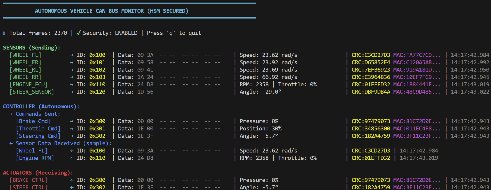

# rust-v-hsm-can

Virtual Hardware Security Module (V-HSM) for CAN Bus security, written in Rust.

**CAN Bus Monitor:**



This repository contains two CAN bus simulators:

1. **[basic/](basic/)** - Original simple CAN bus implementation for learning and testing
2. **[autonomous_controller/](autonomous_controller/)** - Autonomous vehicle CAN bus simulator with 9 ECUs

## Quick Start

### Option A: Autonomous Vehicle Simulator (Recommended)
```bash
cd autonomous_controller
# See autonomous_controller/README.md for detailed instructions
cargo run --bin bus_server  # Terminal 1
cargo run --bin monitor      # Terminal 2
# Start sensor ECUs, controllers, and actuators...
```

### Option B: Basic CAN Simulator
```bash
cd basic
cargo run --bin demo  # Single-process demo
# OR multi-terminal mode (see basic/README.md)
```

## Architecture Overview

### Basic Project Architecture

```
Input ECU ──┐
            │
            ├──> Virtual CAN Bus ──┬──> Output ECU
            │                      │
            │                      └──> Monitor
            │
More ECUs ──┘
```

The system simulates a complete CAN bus network:

- **Virtual CAN Bus**: Broadcast communication channel that simulates real CAN bus behavior. All connected nodes see all messages with sub-millisecond latency.
- **Input ECU (ARM Cortex-M4)**: Emulates a sensor/actuator ECU that sends CAN frames to the bus. Supports both standard (11-bit) and extended (29-bit) CAN IDs.
- **Output ECU (ARM Cortex-M7)**: Emulates a high-performance control ECU that receives and processes CAN frames from the bus.
- **Monitor**: Observes all bus traffic with color-coded timestamps, IDs, data length, and payload.

All components connect to a shared broadcast bus. Any frame sent by any ECU is received by all other connected components.

### Autonomous Vehicle Project Architecture

```
                    CAN BUS SERVER (127.0.0.1:9000)
                              │
        ┌─────────────────────┼─────────────────────┐
        │                     │                     │
   SENSOR LAYER         CONTROLLER LAYER      ACTUATOR LAYER
        │                     │                     │
   ┌────┴────┐          ┌────┴────┐          ┌────┴────┐
   │ 4 Wheels│          │ Auto    │          │ Brake   │
   │ Engine  │─────────>│ Control │─────────>│ Steering│
   │ Steering│          │  Brain  │          │ Control │
   └─────────┘          └─────────┘          └─────────┘
```

**9 ECUs**: wheel_fl, wheel_fr, wheel_rl, wheel_rr, engine_ecu, steering_sensor, autonomous_controller, brake_controller, steering_controller

**Features**:
- Automotive CAN message IDs (0x100-0x3FF range)
- Periodic sensor broadcasts at 10-20 Hz
- Autonomous control loop with speed control and path following
- Safety features: brake pressure limiting, steering rate limiting
- Anomaly detection for wheel speed discrepancies
- Enhanced monitor with automotive message decoding

See [autonomous_controller/README.md](autonomous_controller/README.md) for complete documentation.

## Build

Each project is independent:

```bash
# Build autonomous vehicle simulator
cd autonomous_controller
cargo build --release

# Build basic simulator
cd ../basic
cargo build --release
```

## Project Structure

```
rust-v-hsm-can/
├── basic/                      # Original simple implementation
│   ├── src/
│   │   ├── types.rs           # CAN frame types
│   │   ├── can_bus.rs         # Virtual CAN bus
│   │   ├── ecu.rs             # ECU emulator
│   │   ├── network.rs         # TCP networking
│   │   └── bin/
│   │       ├── bus_server.rs  # Bus server
│   │       ├── monitor.rs     # Traffic monitor
│   │       ├── input_ecu.rs   # Interactive sender
│   │       ├── output_ecu.rs  # Receiver
│   │       └── demo.rs        # Single-process demo
│   └── README.md
│
├── autonomous_controller/      # Realistic autonomous vehicle
│   ├── src/
│   │   ├── types.rs           # Automotive CAN types
│   │   ├── can_bus.rs         # Virtual CAN bus
│   │   ├── ecu.rs             # ECU emulator
│   │   ├── network.rs         # TCP networking
│   │   └── bin/
│   │       ├── bus_server.rs           # Bus server
│   │       ├── monitor.rs              # Enhanced monitor
│   │       ├── wheel_fl.rs             # Front left wheel
│   │       ├── wheel_fr.rs             # Front right wheel
│   │       ├── wheel_rl.rs             # Rear left wheel
│   │       ├── wheel_rr.rs             # Rear right wheel
│   │       ├── engine_ecu.rs           # Engine control
│   │       ├── steering_sensor.rs      # Steering sensors
│   │       ├── autonomous_controller.rs # Autonomous brain
│   │       ├── brake_controller.rs     # Brake actuator
│   │       └── steering_controller.rs  # Steering actuator
│   └── README.md
│
├── CHANGELOG.md           # Project history
└── README.md              # This file
```

## Future Development

- [ ] Implement V-HSM cryptographic layer
- [ ] Add message authentication codes (MAC)
- [ ] Key management system
- [ ] Attack scenario scripts
- [ ] Intrusion detection system
- [ ] Performance benchmarks
- [ ] CAN FD support
