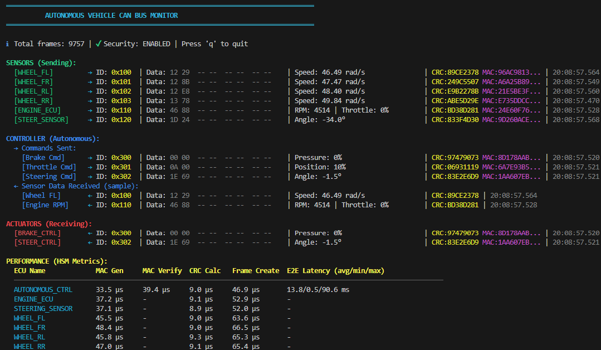
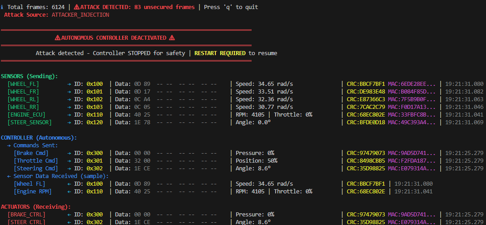

# rust-v-hsm-can

Virtual Hardware Security Module (V-HSM) for CAN Bus security, written in Rust.

**CAN Bus Monitor:**



This repository contains two CAN bus simulators:

1. **[basic/](basic/)** - Original simple CAN bus implementation for learning and testing
2. **[autonomous_controller/](autonomous_controller/)** - Autonomous vehicle CAN bus simulator with 9 ECUs

## Quick Start

### Option A: Autonomous Vehicle Simulator (with HSM security)
```bash
cd autonomous_controller
cargo run              # Standard mode
cargo run -- --perf    # With HSM performance metrics
# Press 'q' to quit
```

### Option B: Basic CAN Simulator
```bash
cd basic
cargo run --bin demo  # Single-process demo
# OR multi-terminal mode (see basic/README.md)
```

## Architecture Overview

### Basic Project Architecture

```
Input ECU ──┐
            │
            ├──> Virtual CAN Bus ──┬──> Output ECU
            │                      │
            │                      └──> Monitor
            │
More ECUs ──┘
```

The system simulates a complete CAN bus network:

- **Virtual CAN Bus**: Broadcast communication channel that simulates real CAN bus behavior. All connected nodes see all messages with sub-millisecond latency.
- **Input ECU (ARM Cortex-M4)**: Emulates a sensor/actuator ECU that sends CAN frames to the bus. Supports both standard (11-bit) and extended (29-bit) CAN IDs.
- **Output ECU (ARM Cortex-M7)**: Emulates a high-performance control ECU that receives and processes CAN frames from the bus.
- **Monitor**: Observes all bus traffic with color-coded timestamps, IDs, data length, and payload.

All components connect to a shared broadcast bus. Any frame sent by any ECU is received by all other connected components.

### Autonomous Vehicle Project Architecture


**9 ECUs**: wheel_fl, wheel_fr, wheel_rl, wheel_rr, engine_ecu, steering_sensor, autonomous_controller, brake_controller, steering_controller

**Key Components**:
- 6 Sensor ECUs sending real-time vehicle data
- V-HSM Security Layer protecting all communications with HMAC-SHA256 + CRC32
- CAN Bus Server as central TCP broadcast hub
- Autonomous Controller processing sensor data and making driving decisions
- 2 Actuator ECUs receiving control commands
- Monitor providing real-time dashboard and security status

**Features**:
- Virtual HSM (Hardware Security Module) with HMAC-SHA256 MAC and CRC32 verification
- Secure boot and protected memory for all ECUs
- Automotive CAN message IDs (0x100-0x3FF range)
- Periodic sensor broadcasts at 10-20 Hz
- Autonomous control loop with speed control and path following
- Safety features: brake pressure limiting, steering rate limiting
- Anomaly detection for wheel speed discrepancies
- Real-time dashboard monitor with security status

### Emergency Attack Response

When an unsecured CAN frame (MAC=0) is detected, the autonomous controller immediately enters emergency shutdown mode:
- **Automatic Shutdown**: All control commands (brake, throttle, steering) stop immediately
- **Safe Monitoring**: Continues reading sensor data but takes NO action
- **Visible Alert**: Monitor displays red warning banner: "⚠ AUTONOMOUS CONTROLLER DEACTIVATED ⚠"
- **Manual Recovery**: Requires restart to resume operation

This fail-safe mechanism prevents compromised commands from reaching vehicle actuators during an active attack.



### HSM Security Keys

Each ECU's Virtual HSM manages 7 cryptographic keys (all 256-bit):

- **Master Key**: Root key for key derivation hierarchy
- **Secure Boot Key**: Firmware signature verification
- **Firmware Update Key**: Firmware update authorization
- **Symmetric Comm Key**: HMAC-SHA256 MAC generation for CAN messages
- **Key Encryption Key**: Secure key exchange/provisioning
- **RNG Seed Key**: Deterministic random number generation
- **Seed/Key Access Token**: Diagnostic access control (UDS seed/key)

Each ECU also maintains **MAC Verification Keys** for all trusted ECUs on the network.

### Attack Detection

All ECUs use threshold-based attack detection with structured error types:
- **MAC errors**: Tolerates 3 consecutive failures (strict cryptographic security)
- **CRC errors**: Tolerates 5 consecutive failures (noise/corruption tolerance)
- **Unsecured frames**: Triggers immediately (no tolerance for injection attacks)

Error counters reset automatically on successful frame validation, allowing recovery from transient failures while detecting sustained attacks.

See [autonomous_controller/README.md](autonomous_controller/README.md) for complete documentation.

## Build

Each project is independent:

```bash
# Build autonomous vehicle simulator
cd autonomous_controller
cargo build --release

# Build basic simulator
cd ../basic
cargo build --release
```

## Project Structure

```
rust-v-hsm-can/
├── basic/                      # Original simple implementation
│   ├── src/
│   │   ├── types.rs           # CAN frame types
│   │   ├── can_bus.rs         # Virtual CAN bus
│   │   ├── ecu.rs             # ECU emulator
│   │   ├── network.rs         # TCP networking
│   │   └── bin/
│   │       ├── bus_server.rs  # Bus server
│   │       ├── monitor.rs     # Traffic monitor
│   │       ├── input_ecu.rs   # Interactive sender
│   │       ├── output_ecu.rs  # Receiver
│   │       └── demo.rs        # Single-process demo
│   └── README.md
│
├── autonomous_controller/      # Realistic autonomous vehicle
│   ├── src/
│   │   ├── types.rs           # Automotive CAN types
│   │   ├── can_bus.rs         # Virtual CAN bus
│   │   ├── ecu.rs             # ECU emulator
│   │   ├── network.rs         # TCP networking
│   │   ├── hsm.rs             # Virtual HSM with cryptography
│   │   ├── protected_memory.rs # Secure boot and memory
│   │   └── bin/
│   │       ├── bus_server.rs           # Bus server
│   │       ├── monitor.rs              # Enhanced monitor
│   │       ├── wheel_fl.rs             # Front left wheel
│   │       ├── wheel_fr.rs             # Front right wheel
│   │       ├── wheel_rl.rs             # Rear left wheel
│   │       ├── wheel_rr.rs             # Rear right wheel
│   │       ├── engine_ecu.rs           # Engine control
│   │       ├── steering_sensor.rs      # Steering sensors
│   │       ├── autonomous_controller.rs # Autonomous brain
│   │       ├── brake_controller.rs     # Brake actuator
│   │       └── steering_controller.rs  # Steering actuator
│   └── README.md
│
├── CHANGELOG.md           # Project history
└── README.md              # This file
```

## Testing

```bash
cargo test                                                          # Integration tests
cargo test --test attack_regression_tests -- --ignored --test-threads=1  # Attack detection tests
```

See [tests/README.md](tests/README.md) for details.

## Future Development

- [x] V-HSM cryptographic layer (HMAC-SHA256 + CRC32)
- [x] Message authentication codes (MAC)
- [x] Key management system
- [x] Attack scenario scripts
- [x] Intrusion detection system
- [x] Performance benchmarks
- [x] HSM performance evaluation mode
- [x] Regression tests with CI/CD integration
- [ ] CAN FD support
- [ ] Deploy and test on hardware cluster
